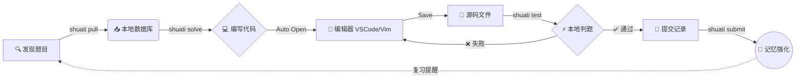

<div align="center">

```text
  ███████╗██╗  ██╗██╗   ██╗ █████╗ ████████╗██╗
  ██╔════╝██║  ██║██║   ██║██╔══██╗╚══██╔══╝██║
  ███████╗███████║██║   ██║███████║   ██║   ██║
  ╚════██║██╔══██║██║   ██║██╔══██║   ██║   ██║
  ███████║██║  ██║╚██████╔╝██║  ██║   ██║   ██║
  ╚══════╝╚═╝  ╚═╝ ╚═════╝ ╚═╝  ╚═╝   ╚═╝   ╚═╝
```

# Shuati CLI

**专为算法爱好者打造的本地化、智能化命令行工具**

[](https://github.com/Xustalis/shuati-Cli/releases)
[](https://github.com/Xustalis/shuati-Cli/actions)
[](LICENSE)
[](https://en.cppreference.com/w/cpp/20)

[🚀 快速开始](#-15分钟快速上手) • [📥 安装指南](#-安装指南) • [✨ 核心特性](#-核心特性) • [📚 文档](#-详细文档) • [❓ FAQ](#-常见问题)

</div>

---

## 项目简介

**Shuati CLI** 是一款专为oier和coder设计的命令行工具，帮助用户高效管理算法练习题、追踪学习进度、分析错误模式，并提供智能复习建议。

### 🛠️ 工作流演示



## 核心功能

### 🎯 题目管理
- **多平台支持**: 支持从 Codeforces、LeetCode、洛谷、蓝桥云课等平台自动抓取题目
- **本地题目创建**: 支持手动创建本地题目，记录个人练习内容
- **统一存储**: 所有题目以Markdown格式存储，便于阅读和编辑
- **标签系统**: 支持为题目添加难度、标签等元数据

### 📊 进度追踪
- **解题记录**: 自动记录每次提交的 verdict（AC/WA/TLE等）
- **通过率统计**: 实时统计各题目的通过情况
- **历史回顾**: 查看完整的解题历史和时间线

### 🧠 智能复习
- **SM2算法**: 基于SuperMemo-2间隔重复算法，智能安排复习时间
- **遗忘曲线**: 根据艾宾浩斯遗忘曲线优化复习间隔
- **错题分析**: 自动分析错误类型（逻辑错误、边界条件、算法理解等）

### 🤖 AI辅助
- **智能提示**: 集成DeepSeek AI，提供解题思路和提示
- **代码分析**: 分析代码错误并提供改进建议
- **个性化推荐**: 根据学习进度推荐适合的题目

### ⚡ 快速评测
- **本地编译**: 支持C++、Python等语言的本地编译和运行
- **测试用例**: 自动获取样例测试用例进行验证
- **性能分析**: 检测时间复杂度和空间复杂度

## 技术栈

- **编程语言**: C++20
- **构建系统**: CMake 3.20+
- **包管理**: vcpkg
- **数据库**: SQLite3
- **UI框架**: FTXUI（终端UI）
- **HTTP客户端**: cpr
- **JSON处理**: nlohmann/json
- **命令行解析**: CLI11

## 安装指南

### 系统要求

- Windows 10/11 (x64)
- macOS 10.15+ (Intel/Apple Silicon)
- Linux (Ubuntu 20.04+, CentOS 8+)

### 从源码编译

#### 前置依赖

1. **CMake** (>= 3.20)
2. **vcpkg** - C++包管理器
3. **Git**

#### 编译步骤

```bash
# 克隆仓库
git clone https://github.com/Xustalis/shuati-Cli.git
cd shuati-Cli

# 配置项目（使用vcpkg）
cmake -B build -S . -DCMAKE_TOOLCHAIN_FILE=[vcpkg路径]/scripts/buildsystems/vcpkg.cmake

# 构建
cmake --build build --config Release

# 运行测试
ctest --test-dir build -C Release

# 安装（可选）
cmake --install build
```

### Windows安装包

下载最新的Windows安装包：

```powershell
# 使用PowerShell安装
irm https://github.com/Xustalis/shuati-Cli/releases/latest/download/shuati-cli-setup.exe -OutFile shuati-cli-setup.exe
.\shuati-cli-setup.exe
```

## 使用指南

### 初始化项目

```bash
# 创建新的刷题项目目录
mkdir my-algorithm-practice
cd my-algorithm-practice

# 初始化Shuati CLI
shuati init
```

### 添加题目

```bash
# 从URL自动抓取题目
shuati pull https://leetcode.com/problems/two-sum/
shuati pull https://codeforces.com/problemset/problem/4/A
shuati pull https://www.luogu.com.cn/problem/P1001

# 创建本地题目
shuati create "自定义题目名称" --tags "dp,array" --difficulty medium
```

### 开始练习

```bash
# 列出所有题目
shuati list

# 解决指定题目（使用TID或题目ID）
shuati solve 1
shuati solve lc_1

# 查看题目详情
shuati view 1
```

### 测试代码

```bash
# 编译并运行测试
shuati test 1 --lang cpp

# 使用自定义测试用例
shuati test 1 --input "1 2 3" --expected "6"
```

### 复习管理

```bash
# 查看今日复习任务
shuati review

# 标记题目为已复习
shuati review done 1

# 查看错题分析
shuati analyze
```

### AI辅助功能

```bash
# 获取解题提示
shuati hint 1

# 分析当前代码
shuati analyze code

# 配置AI（需要DeepSeek API密钥）
shuati config set api_key your_api_key_here
```

## 项目结构

```
shuati-Cli/
├── src/                    # 源代码
│   ├── cmd/               # 命令行接口
│   ├── core/              # 核心业务逻辑
│   ├── adapters/          # 外部服务适配器
│   ├── infra/             # 基础设施层
│   └── utils/             # 工具函数
├── include/               # 头文件
├── resources/             # 资源文件
├── tests/                 # 测试代码
├── installer/             # Windows安装程序
└── docs/                  # 文档
```

## 配置说明

配置文件位于项目目录下的 `.shuati/config.json`：

```json
{
  "api_key": "your_deepseek_api_key",
  "api_base": "https://api.deepseek.com/v1",
  "model": "deepseek-chat",
  "language": "cpp",
  "max_tokens": 4096,
  "editor": "code",
  "ai_enabled": true,
  "template_enabled": true
}
```

## 开发指南

### 构建开发版本

```bash
cmake -B build -S . -DCMAKE_BUILD_TYPE=Debug
cmake --build build
```

### 运行测试

```bash
# 运行所有测试
ctest --test-dir build

# 运行特定测试
./build/test_version
./build/test_judge_complex
```

### 代码风格

项目使用clang-format进行代码格式化：

```bash
clang-format -i src/**/*.cpp include/**/*.hpp
```

## 贡献指南

欢迎提交Issue和Pull Request！请阅读 [CONTRIBUTING.md](CONTRIBUTING.md) 了解详细信息。

### 提交规范

- 使用 [Conventional Commits](https://www.conventionalcommits.org/) 规范
- 确保所有测试通过
- 更新相关文档

## 许可证

本项目采用 [MIT License](LICENSE) 开源许可证。

## 致谢

感谢以下开源项目的支持：
- [FTXUI](https://github.com/ArthurSonzogni/FTXUI) - 终端UI框架
- [CLI11](https://github.com/CLIUtils/CLI11) - 命令行解析库
- [nlohmann/json](https://github.com/nlohmann/json) - JSON处理库
- [SQLiteCpp](https://github.com/SRombauts/SQLiteCpp) - SQLite C++封装

## 联系我们

- **GitHub Issues**: [提交问题](https://github.com/Xustalis/shuati-Cli/issues)
- **Email**: gmxenith@gmail.com

---

**Happy Coding! 🚀**
