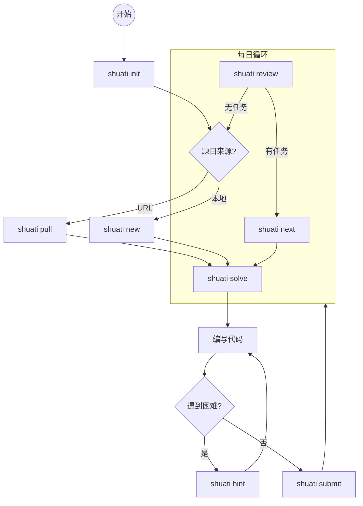

# shuati CLI - 你的 AI 智能算法教练 🚀

[]()
[](https://opensource.org/licenses/MIT)

> **刷题不是为了 AC，而是为了不再犯同样的错。**

**shuati CLI** 是一个以命令行 (CLI) 优先的智能刷题辅助工具，专为极客开发者设计。它不直接提供答案，而是像教练一样，追踪你的错误，提供基于 AI 的低成本提示，并利用间隔重复算法（SM-2）科学安排复习计划。

---

## 🌟 核心理念

1.  **错误驱动学习**：不仅仅记录是否 AC，更记录**为何**出错 (Off-by-one, 贪心误用, etc.)。
2.  **间隔重复 (SM-2)**：内置 SuperMemo-2 算法，根据反馈质量自动安排下次复习时间。
3.  **AI 辅助**：集成 AI 接口 (DeepSeek)，提供不剧透的思路提示。
4.  **CLI 沉浸**：无需离开终端，全键盘操作。

---

## 🚀 工作流 (Workflow)


```mermaid
graph TD
    Start((开始)) --> Init[shuati init]
    Init --> Pull{题目来源?}
    Pull -->|URL| PullWeb[shuati pull <url>]
    Pull -->|本地| New[shuati new <title>]
    
    PullWeb --> Solve[shuati solve <id>]
    New --> Solve
    
    Solve --> Code[编写代码]
    Code --> Stuck{遇到困难?}
    Stuck -->|是| Hint[shuati hint <id>]
    Hint --> Code
    
    Stuck -->|否| Submit[shuati submit <id>]
    Submit --> ReviewLoop
    
    subgraph ReviewLoop [每日循环]
        Review[shuati review] -->|有任务| Next[shuati next]
        Next --> Solve
        Review -->|无任务| Pull
    end
```

---

## 🛠️ 安装指南

### 前置要求
*   C++20 编译器 (MSVC, GCC, Clang)
*   CMake 3.20+
*   Git

### 编译安装
```bash
# 1. 克隆仓库
git clone https://github.com/your-username/shuati-cli.git
cd shuati-cli

# 2. 安装依赖 (使用 vcpkg)
git clone https://github.com/microsoft/vcpkg.git
./vcpkg/bootstrap-vcpkg.bat # Windows
# ./vcpkg/bootstrap-vcpkg.sh # Linux/macOS
./vcpkg/vcpkg.exe install

# 3. 编译 release 版本
cmake -B build -S . -G "Visual Studio 17 2022" -DCMAKE_TOOLCHAIN_FILE=vcpkg/scripts/buildsystems/vcpkg.cmake
cmake --build build --config Release

# 4. 运行
./build/Release/shuati.exe
```

---

## 🎮 使用说明

**推荐：直接运行 `shuati` 进入交互模式 (REPL)**

### 交互模式 (Interactive Mode)
```bash
shuati
```
进入后可直接输入命令：
```text
shuati > init
shuati > pull https://leetcode.com/problems/two-sum/
shuati > solve web_12345
```

### 常用命令

| 命令 | 说明 | 示例 |
|:---|:---|:---|
| `init` | 初始化项目 | `shuati init` |
| `config` | 配置 API Key | `config --api-key sk-xxxx` |
| `pull <url>` | 拉取题目 | `pull https://leetcode.com/...` |
| `solve <id>` | **生成代码模板** | `solve web_12345` |
| `hint <id>` | **AI 提示 (非答案)** | `hint web_12345` |
| `submit <id>` | **提交记录** | `submit web_12345 -q 3` |
| `review` | 查看待复习题目 | `shuati review` |
| `stats` | 查看错误统计 | `shuati stats` |

---

## 🤝 贡献 (Contributing)

非常欢迎 Fork 和 PR！

1.  Fork 本仓库
2.  创建你的 Feature 分支 (`git checkout -b feature/AmazingFeature`)
3.  提交更改 (`git commit -m 'Add some AmazingFeature'`)
4.  推送到分支 (`git push origin feature/AmazingFeature`)
5.  提交 Pull Request

### 开发计划
*   [ ] 更多 OJ 适配 (Codeforces, Luogu)
*   [ ] 编译器集成 (一键运行测试)
*   [ ] 更加炫酷的 TUI 界面

---

## 📄 开源协议

本项目采用 [MIT License](LICENSE) 开源。

Copyright (c) 2026 Shuati CLI Team
