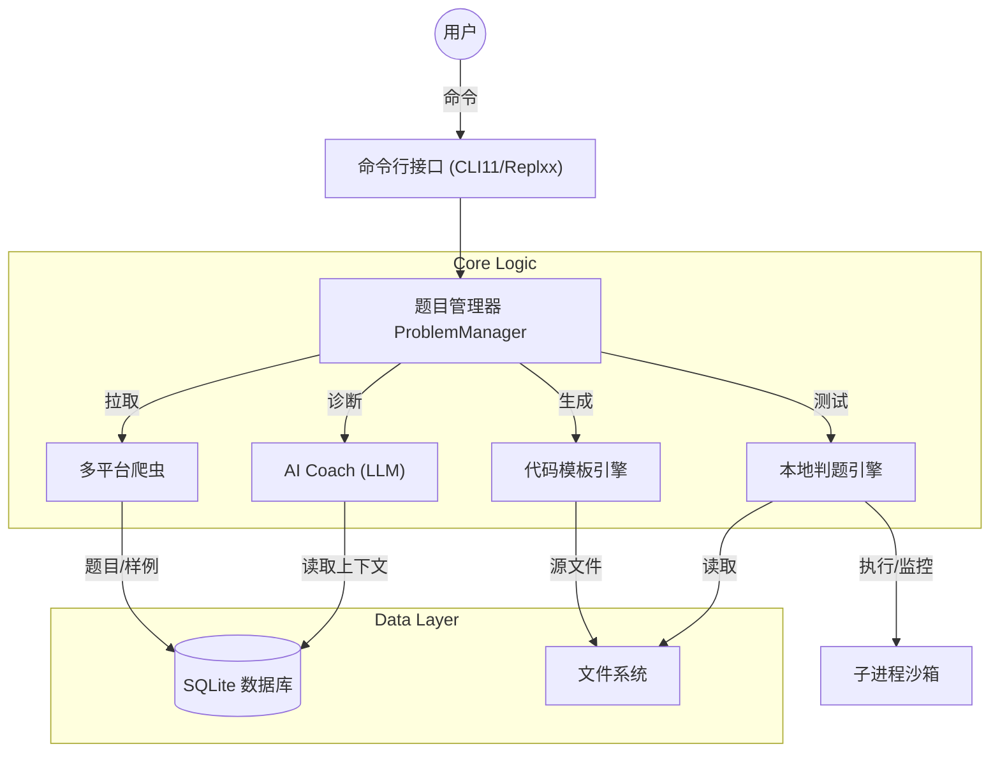

<div align="center">

```text
  ███████╗██╗  ██╗██╗   ██╗ █████╗ ████████╗██╗
  ██╔════╝██║  ██║██║   ██║██╔══██╗╚══██╔══╝██║
  ███████╗███████║██║   ██║███████║   ██║   ██║
  ╚════██║██╔══██║██║   ██║██╔══██║   ██║   ██║
  ███████║██║  ██║╚██████╔╝██║  ██║   ██║   ██║
  ╚══════╝╚═╝  ╚═╝ ╚═════╝ ╚═╝  ╚═╝   ╚═╝   ╚═╝
```

# Shuati CLI

[](https://github.com/Xustalis/shuati-Cli/actions/workflows/ci.yml)
[](https://opensource.org/licenses/MIT)
[](https://en.cppreference.com/w/cpp/20)
[](https://github.com/Xustalis/shuati-Cli/releases)

**Shuati CLI** 是一个基于命令行的算法竞赛（ACM/OI）辅助工具，旨在通过自动化繁琐流程（拉题、样例生成、本地测试）并集成 AI 辅助，构建一个高效、闭环的本地练习环境。

本项目适合习惯使用 CLI 和 Vim/VSCode 等本地编辑器，且希望脱离浏览器 Web IDE 低效调试环节的开发者。

[安装](#-安装) • [工作流](#-核心工作流) • [配置](#-配置说明) • [判题机制](#-本地判题引擎) • [贡献](#-贡献与开发)

</div>

---

## 🏗 架构概览

Shuati CLI 采用分层架构设计，核心包括爬虫适配器、本地判题沙箱和 AI 诊断模块。


```mermaid
graph TD
    User((用户)) -->|命令| CLI["命令行接口 (CLI11/Replxx)"]
    CLI --> PM["题目管理器 ProblemManager"]
    
    subgraph Core Logic
        PM -->|拉取| Crawler[多平台爬虫]
        PM -->|生成| Template[代码模板引擎]
        PM -->|测试| Judge[本地判题引擎]
        PM -->|诊断| AI["AI Coach (LLM)"]
    end
    
    subgraph Data Layer
        DB[("SQLite 数据库")]
        FS[文件系统]
    end
    
    Crawler -->|题目/样例| DB
    Template -->|源文件| FS
    Judge -->|读取| FS
    Judge -->|执行/监控| Sandbox[子进程沙箱]
    AI -->|读取上下文| DB
```

## 📦 快速安装 (Quick Start)

### 1. 普通用户 (推荐)

**适用人群**: 算法竞赛选手、刷题爱好者。无需懂 C++ 编译。

**核心依赖**:
1.  **Git**: 用于项目版本管理（本项目基于 git 目录结构）。
2.  **编译器**:
    *   **C++ 选手**: 需安装 `g++` (推荐 MinGW-w64) 并加入环境变量 `PATH`。
    *   **Python 选手**: 需安装 `python` 并加入环境变量 `PATH`。

**安装步骤**:
1.  **下载**: 前往 [Releases](https://github.com/Xustalis/shuati-Cli/releases) 下载最新版本的 `shuati.exe` (Windows) 或二进制文件 (Linux/macOS)。
2.  **配置**: 将 `shuati.exe` 放入任意目录（如 `C:\Program Files\Shuati\`），并将该目录添加到系统 `PATH` 环境变量中。
3.  **验证**:
    ```bash
    shuati --version
    # 应输出: 1.2.0
    ```

### 2. 开发者 (源码构建)

**适用人群**: 希望贡献代码或自行修改功能的开发者。

**开发依赖**:
*   **Git**: `git`
*   **构建工具**: `CMake` 3.20+
*   **编译器**: MSVC (Visual Studio 2022), GCC 10+, 或 Clang 12+
*   **包管理**: `vcpkg` (强烈推荐，用于管理 CLI11, fmt, nlohmann-json 等库)

```bash
# Clone
git clone https://github.com/Xustalis/shuati-Cli.git
cd shuati-cli

# Configure (以 Windows + vcpkg 为例)
# 请替换 <VCPKG_ROOT> 为你的 vcpkg 安装路径
cmake -B build -S . -DCMAKE_TOOLCHAIN_FILE=<VCPKG_ROOT>/scripts/buildsystems/vcpkg.cmake

# Build
cmake --build build --config Release

# Run
./build/Release/shuati
```

## � 核心工作流

Shuati CLI 的设计理念是 **"Pull -> Solve -> Test -> Debug"** 闭环。

### 1. 初始化项目
在任意工作目录下初始化结构，生成 `shuati.db` 和配置文件。
```bash
shuati init
```

### 2. 拉取题目 (Pull)
支持 LeetCode (CN/US), Luogu, Codeforces 等平台。
```bash
shuati pull https://leetcode.cn/problems/two-sum/
```
*   **自动行为**: 抓取题目描述、提取 Tags/难度、**下载所有测试样例**存入本地数据库。

### 3. 解题 (Solve)
生成模板代码并自动打开编辑器。
```bash
shuati solve 1  # 使用 ID（由 pull 返回）
```
*   **代码生成**: 基于 `Config.template` 自动生成包含题目元信息的源文件 (e.g., `1.two_sum.cpp`)。
*   **Editor**: 自动唤起配置的编辑器 (默认 `code`)。

### 4. 本地测试 (Test)
利用本地判题引擎运行样例。
```bash
shuati test 1
```
*   **输出**: 实时显示每个 Test Case 的 Verdict (AC/WA/TLE/RE)。
*   **WA 详情**: 自动展示 Input, Output, Expected 差异。

### 5. AI 诊断 (Debug)
当遇到难以理解的 WA 或 RE 时，请求 AI 介入。
```bash
shuati debug 1
```
*   **Context**: 自动打包题目描述、你的代码、**Failing Case 的实际输出**以及报错信息。
*   **Response**: AI 分析根本原因并给出修复思路。

## ⚙ 配置说明

配置文件位于 `~/.shuati/config.json` 或项目根目录 `config.json`。

```json
{
  "user": {
    "name": "Developer",
    "language": "cpp"   // 默认语言: cpp / python
  },
  "editor": {
    "command": "code"   // 指令: code / vim / nvim
  },
  "ai": {
    "enabled": true,
    "provider": "openai", 
    "base_url": "https://api.openai.com/v1",
    "api_key": "sk-your-key-here",
    "model": "gpt-4"
  },
  "proxy": "" // 可选 HTTP 代理
}
```

## ⚖ 本地判题引擎

本项目内置了一个轻量级 OJ 判题器 (`src/core/judge.cpp`)，实现标准 ACM 判题逻辑。

| Verdict | 含义 | 判定逻辑 |
| :--- | :--- | :--- |
| **AC** | Accepted | Stdout 与 Expected 一致 (忽略行末空格) |
| **WA** | Wrong Answer | Stdout 与 Expected 不一致 |
| **TLE** | Time Limit Exceeded | 运行时间超过限制 (默认 1s)，子进程被 Kill |
| **MLE** | Memory Limit Exceeded | 峰值内存超过限制 (Windows下使用 PSAPI 监控) |
| **RE** | Runtime Error | 进程退出码非 0 |
| **CE** | Compile Error | 编译器 (g++) 返回非 0 |

## 🤝 贡献与开发

我们非常欢迎社区贡献。为了保持代码质量，请遵循以下规范：

*   **Bug 提交**: 请使用 [.github/ISSUE_TEMPLATE/bug_report.md](.github/ISSUE_TEMPLATE/bug_report.md) 模板。
*   **功能建议**: 请提交 Issue 讨论设计。
*   **代码提交**:
    1.  阅读 [贡献指南 (.github/CONTRIBUTING.md)](.github/CONTRIBUTING.md)。
    2.  确保通过 `ctest` 单元测试。
    3.  代码风格遵循 Google C++ Style。

### 主要目录说明
*   `src/adapters/`: 包含各 OJ 的爬虫实现，新增 OJ 支持请在此扩展。
*   `src/core/`: 核心逻辑，包括判题器 (`judge.cpp`) 和 题目管理 (`problem_manager.cpp`)。
*   `src/cmd/`: CLI 交互逻辑。

---

**License**: [MIT](LICENSE)
