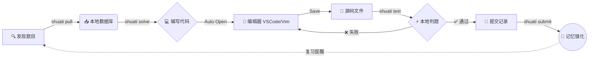
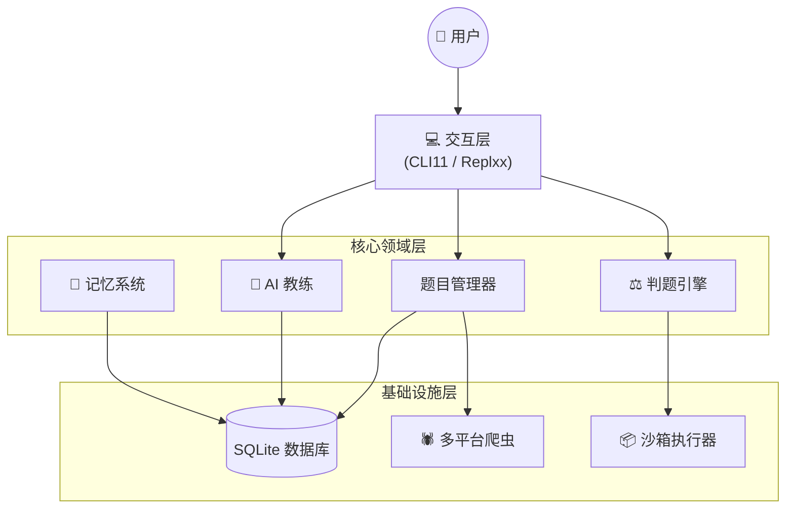

<div align="center">

```text
  ███████╗██╗  ██╗██╗   ██╗ █████╗ ████████╗██╗
  ██╔════╝██║  ██║██║   ██║██╔══██╗╚══██╔══╝██║
  ███████╗███████║██║   ██║███████║   ██║   ██║
  ╚════██║██╔══██║██║   ██║██╔══██║   ██║   ██║
  ███████║██║  ██║╚██████╔╝██║  ██║   ██║   ██║
  ╚══════╝╚═╝  ╚═╝ ╚═════╝ ╚═╝  ╚═╝   ╚═╝   ╚═╝
```

# Shuati CLI

**专为算法爱好者打造的本地化、智能化命令行工具**

[](https://github.com/Xustalis/shuati-Cli/releases)
[](https://github.com/Xustalis/shuati-Cli/actions)
[](LICENSE)
[](https://en.cppreference.com/w/cpp/20)

[🚀 快速开始](#-15分钟快速上手) • [📥 安装指南](#-安装指南) • [✨ 核心特性](#-核心特性) • [📚 文档](#-详细文档) • [❓ FAQ](#-常见问题)

</div>

---

## 📖 项目简介

**Shuati CLI** 不仅仅是一个爬虫，它是一个能够接管你算法学习全流程的**本地化 IDE**。
**Shuati CLI** 将 "拉题 -> 编码 -> 测试 -> 调试 -> 提交" 的完整工作流搬到本地终端。配合编辑器（VSCode/Vim/JetBrains），利用本地强大的编译器和调试器，享受刷题体验。

---

## 🚀 15分钟快速上手

按照以下步骤，在 15 分钟内完成环境搭建并解决你的第一道算法题。

### 1️⃣ 环境自检 (1分钟)
确保你的电脑满足以下基本要求：
- **OS**: Windows 10/11, Linux, 或 macOS
- **Compiler**: `g++` (GCC 10+) 或 `clang` (支持 C++20)
- **Editor**: VSCode, Vim, Sublime 等任意编辑器

### 2️⃣ 一键安装 (3分钟)

选择适合你系统的安装命令：

**Windows (PowerShell)**:
```powershell
iwr https://raw.githubusercontent.com/Xustalis/shuati-Cli/main/install.ps1 -useb | iex
```

**Linux / macOS**:
```bash
curl -fsSL https://raw.githubusercontent.com/Xustalis/shuati-Cli/main/install.sh | bash
```

> **注意**: 安装完成后，请重启终端以使环境变量生效。

### 3️⃣ 初始化工作区 (2分钟)

```bash
# 创建并进入一个新的练习目录
mkdir my-algo-space
cd my-algo-space

# 初始化 Shuati 项目
shuati init
```

### 4️⃣ 这是你的第一道题 (5分钟)

以 LeetCode "两数之和" 为例：

```bash
# 1. 拉取题目 (支持 LeetCode CN/US, Luogu, Codeforces)
shuati pull https://leetcode.cn/problems/two-sum/

# 2. 开始解题 (自动生成文件并打开编辑器)
shuati solve 1
```

此时，`solution_1.cpp` 已经生成并打开。编写你的代码：

```cpp
// 在 solution_1.cpp 中
#include <vector>
#include <unordered_map>
using namespace std;

class Solution {
public:
    vector<int> twoSum(vector<int>& nums, int target) {
        unordered_map<int, int> map;
        for (int i = 0; i < nums.size(); i++) {
            int complement = target - nums[i];
            if (map.count(complement)) {
                return {map[complement], i};
            }
            map[nums[i]] = i;
        }
        return {};
    }
};
```

### 5️⃣ 极速测试 (4分钟)

在不离开终端的情况下运行测试：

```bash
# 运行本地测试（包含样例和自动生成的边界用例）
shuati test 1
```

🎉 **恭喜！** 你已经完成了第一次本地刷题闭环。

### 6️⃣ [进阶] AI 智能对拍 (1分钟)

当静态测试点不足以覆盖边界情况时，开启 AI 帮手：

```bash
# 生成生成器和标程，进行 100 轮随机数据对拍
shuati test 1 --max 100 --oracle ai
```

- **自动生成**: AI 会根据题目描述自动写出 `gen.py` (数据生成) 和 `sol.py` (标程)。
- **自动纠错**: 如果发现错误，Shuati 会自动保存数据并请求 AI 分析原因。
- **安全**: 系统会自动验证 AI 写的标程是否通过样例，防止误判。

> **提示**: 需要先通过 `shuati config --api-key` 配置 API Key (支持 DeepSeek 等)。

---

## ✨ 核心特性

<div align="center">

| 🤖 AI 辅助教练 | 🕷️ 多平台支持 | 🧪 智能测试 |
| :---: | :---: | :---: |
| 内置 LLM 接口，提供<br>代码诊断、思路提示<br>和复杂度分析 | 支持 LeetCode (CN/US)<br>Luogu, Codeforces<br>Lanqiao 等主流平台 | 自动生成边界用例<br>模糊判题 (Fuzzy Judge)<br>可视化测试报告 |

| 📉 记忆曲线 | 💻 本地优先 | 🔌 强大集成 |
| :---: | :---: | :---: |
| 基于艾宾浩斯曲线<br>智能推荐复习题目<br>告别遗忘 | SQLite 本地数据库<br>离线缓存题目<br>代码完全掌控 | 适配 VSCode/Vim<br>支持 C++20, Python<br>无缝 Shell 集成 |

</div>

### 🛠️ 工作流演示


```mermaid
graph LR
    A[🔍 发现题目] -->|shuati pull| B("📥 本地数据库")

    B -->|shuati solve| C{💻 编写代码}
    C -->|Auto Open| D[📝 编辑器 VSCode/Vim]
    D -->|Save| E[💾 源码文件]
    E -->|shuati test| F{⚡ 本地判题}
    F -->|❌ 失败| D
    F -->|✅ 通过| G[🚀 提交记录]
    G -->|shuati submit| H((🧠 记忆强化))
    H -.->|复习提醒| A
```

---

## 📥 安装指南

我们提供了多种安装方式，建议使用[快速开始](#-15分钟快速上手)中的一键脚本。

### 手动下载安装
1. 前往 [Releases 页面](https://github.com/Xustalis/shuati-Cli/releases) 下载对应系统的压缩包。
2. 解压文件。
3. 将解压目录添加到系统的 `PATH` 环境变量中。

### 验证安装
```bash
shuati --version
# 应输出类似: shuati version 1.5.2
```

---

## ⚙️ 配置说明

配置文件位于 `.shuati/config.json`。你可以通过命令行快速修改配置。

### 常用配置命令

```bash
# 开启 AI 功能 (推荐)
shuati config --api-key "sk-xxxxxxxxxxxxxxxx" --model "deepseek-chat"

# 设置默认编程语言
shuati config --language python

# 设置默认编辑器
shuati config --editor "code"      # VSCode
shuati config --editor "vim"       # Vim
shuati config --editor "notepad"   # Windows Notepad
```

### AI 功能配置
Shuati CLI 支持所有兼容 OpenAI 格式的 API（如 DeepSeek, Moonshot, ChatGPT）。

```json
{
  "ai_enabled": true,
  "api_key": "sk-your-key",
  "api_base": "https://api.deepseek.com/v1",
  "model": "deepseek-chat"
}
```

---

## 📚 详细文档

### 核心命令速查

| 命令 | 简写 | 功能描述 | 示例 |
| :--- | :--- | :--- | :--- |
| `init` | - | 初始化当前目录为工作区 | `shuati init` |
| `pull` | - | 从 URL 拉取题目 | `shuati pull https://leetcode.cn/...` |
| `solve` | `s` | 生成代码并打开编辑器 | `shuati s 1` |
| `test` | `t` | 编译并运行测试 | `shuati t 1` |
| `submit` | - | 记录做题结果和心得 | `shuati submit 1 -q 5` |
| `list` | `ls` | 列出已拉取的题目 | `shuati ls` |
| `clean` | - | 清理临时构建文件 | `shuati clean` |
| `hint` | - | 获取 AI 思路提示 | `shuati hint 1` |

### 交互模式 (REPL)
直接输入 `shuati` 不带参数即可进入交互模式，支持命令自动补全和历史记录。

```text
C:\Project> shuati
shuati > list
[1] Two Sum (Easy) [Ungrasped]
shuati > test 1 --ui
```

---

## ❓ 常见问题 (FAQ)

<details>
<summary><strong>Q: <code>list</code> 命令在 Windows 上显示乱码或 "invalid utf8"？</strong></summary>

**A:** 这是由于 Windows 终端默认编码 (GBK) 与 SQLite (UTF-8) 不匹配导致。
- 解决方法 1: 在终端执行 `chcp 65001` 切换到 UTF-8 页。
- 解决方法 2: 使用 Windows Terminal 或 VSCode 内置终端。
- 我们已在 v1.3.1+ 版本中增加了自动修复机制。

</details>

<details>
<summary><strong>Q: 运行 <code>test</code> 时提示 "Compiler not found"？</strong></summary>

**A:** Shuati 依赖系统的编译器。
- **C++**: 请安装 MinGW-w64 (Windows) 或 GCC (Linux/macOS)，并确保 `g++` 在 PATH 中。
- **Python**: 请安装 Python 3.8+，并确保 `python` 在 PATH 中。

</details>

<details>
<summary><strong>Q: 为什么生成的测试用例不通过？</strong></summary>

**A:** `shuati test` 会自动生成边界用例（如空数组、大数等）。如果你的代码没有处理这些边界情况，就会失败。这正是本地测试的价值——帮助你写出更健壮的代码！使用 `--ui` 参数可以查看详细的失败数据。

</details>

---

## 🏗️ 系统架构

Shuati CLI 采用分层架构设计 (Domain-Driven Design)，确保高扩展性和可维护性。


```mermaid
graph TD
    User((👤 用户)) --> CLI["💻 交互层<br>(CLI11 / Replxx)"]
    
    subgraph Core [核心领域层]
        PM[题目管理器]
        Judge[⚖️ 判题引擎]
        AI[🤖 AI 教练]
        Memory[🧠 记忆系统]
    end
    
    subgraph Infra [基础设施层]
        DB[(SQLite 数据库)]
        Crawler[🕷️ 多平台爬虫]
        Sandbox[📦 沙箱执行器]
    end
    
    CLI --> PM
    CLI --> Judge
    CLI --> AI
    
    PM --> Crawler
    PM --> DB
    Judge --> Sandbox
    AI --> DB
    Memory --> DB
```

---

## 🤝 贡献指南

我们非常欢迎社区贡献！无论是修复 Bug、添加新平台的爬虫，还是改进文档。

1. **Fork** 本仓库
2. **Clone** 到本地: `git clone https://github.com/your-username/shuati-Cli.git`
3. **Branch**: `git checkout -b feat/new-feature`
4. **Commit**: `git commit -m "feat: add support for AtCoder"`
5. **Push**: `git push origin feat/new-feature`
6. **Pull Request**: 在 GitHub 上发起 PR

详细开发指南请参阅 [CONTRIBUTING.md](CONTRIBUTING.md)。

---

## 📄 许可证

本项目采用 [MIT License](LICENSE) 开源。

Copyright (c) 2024-2026 Xustalis
