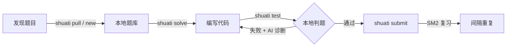

<div align="center">

```text
  ███████╗██╗  ██╗██╗   ██╗ █████╗ ████████╗██╗
  ██╔════╝██║  ██║██║   ██║██╔══██╗╚══██╔══╝██║
  ███████╗███████║██║   ██║███████║   ██║   ██║
  ╚════██║██╔══██║██║   ██║██╔══██║   ██║   ██║
  ███████║██║  ██║╚██████╔╝██║  ██║   ██║   ██║
  ╚══════╝╚═╝  ╚═╝ ╚═════╝ ╚═╝  ╚═╝   ╚═╝   ╚═╝
```

**专为 OIer 和 Coder 打造的本地化、智能化命令行刷题工具**

[](https://github.com/Xustalis/shuati-Cli/releases)
[](https://github.com/Xustalis/shuati-Cli/actions)
[](LICENSE)
[](https://en.cppreference.com/w/cpp/20)

[快速开始](#15分钟快速上手) · [安装指南](#安装指南) · [核心特性](#核心功能与亮点) · [TUI 模式](#tui-交互模式) · [命令速查](#常用命令速查) · [FAQ](#常见问题)

</div>

---

## 项目简介

Shuati CLI 是一款专为算法爱好者设计的命令行工具。它能从各大 OJ 平台自动拉取题目，接管你的 **编码 -> 测试 -> 提交** 工作流，更引入了 AI 辅助诊断和 SM2 记忆曲线，高效管理算法练习题、追踪学习进度、自动分析错题，让刷题更加智能化。

> **v0.1.1 更新亮点：** 强化 TUI 稳定性与可用性（避免退出后崩溃、完善滚动与流式输出）；同时修复 `python` 判题在 TUI/测试流程中的功能障碍。详见 [TUI 交互模式](#tui-交互模式)。

## 15分钟快速上手

### 1. 一键安装

**Windows:**

从 [Releases](https://github.com/Xustalis/shuati-Cli/releases/latest) 页面下载最新的 `shuati-setup-x64-v*.exe` 安装包并运行。

或通过 PowerShell 脚本安装（免安装包）：

```powershell
irm https://raw.githubusercontent.com/Xustalis/shuati-Cli/main/install.ps1 | iex
```

**Linux / macOS:**

```bash
curl -fsSL https://raw.githubusercontent.com/Xustalis/shuati-Cli/main/install.sh | bash
```

### 2. 初始化练习目录

```bash
mkdir my-algorithm-practice
cd my-algorithm-practice
shuati init
```

### 3. 开始你的第一题

以 LeetCode 经典第一题 "两数之和" 为例：

```bash
# 从 OJ 平台拉取题目（同时支持洛谷、Codeforces、蓝桥云课）
shuati pull https://leetcode.cn/problems/two-sum/

# 开始解题（自动生成代码模板并打开编辑器）
shuati solve 1
```

### 4. 一键本地评测

```bash
shuati test 1
```

全部通过后运行 `shuati submit 1` 记录到错题本。如果测试失败且已配置 AI，工具会自动诊断代码问题。

## TUI 交互模式

Shuati CLI v0.2.0+ 引入了全新的 **全屏 TUI (Terminal User Interface)** 模式，为你提供沉浸式的刷题体验：

- **二级菜单系统**：每个核心命令（pull、solve、config、status）现在都有独立的交互界面。
- **智能 Pull**：支持 URL 实时校验，异步拉取并显示进度条，完成后自动返回。
- **Solve 筛选面板**：按来源（洛谷/力扣/CF）、难度进行多维度筛选，支持题号/标题关键字搜索。
- **状态统计**：一键查看总题数、AC 率、待复习题目及近期活跃度。
- **极速响应**：全新事件驱动架构，界面响应时间 < 500ms，输入丝滑无死角。

### 快捷键约定

- **Enter**：确认/执行
- **Esc**：返回上级菜单
- **Ctrl+C**：强制退出
- **↑ / ↓**：切换列表项或历史记录
- **Tab**：命令补全

---

## 常用命令速查

| 命令 | 用法示例 | 说明 |
| :--- | :--- | :--- |
| **pull** | `shuati pull <url>` | 从 OJ 平台拉取题目、样例并初始化本地文件 |
| **solve** | `shuati solve <id>` | 创建或打开代码模板，配置好编辑器后自动启动 |
| **test** | `shuati test <id>` | 在沙箱中运行本地代码并对比全部测试用例 |
| **record**| `shuati record <id>`| 记录题目掌握情况，自动计算下一次复习时间 |
| **list**  | `shuati list` | 浏览本地题库，支持通过率与难度过滤 |
| **status**| `shuati status` | 显示当前学习统计与进度 |
| **config**| `shuati config` | 配置编辑器路径、OJ Cookie、AI API Key 等 |
| **hint**  | `shuati hint <id>` | 调用 AI 针对当前题目和代码给出提示或思路 |
| **init**  | `shuati init` | 在当前文件夹初始化 .shuati 存储结构 |

---

## 核心功能与亮点


```mermaid
graph LR
    A["发现题目"] -->|shuati pull / new| B["本地题库"]
    B -->|shuati solve| C["编写代码"]
    C -->|shuati test| D{"本地判题"}
    D -->|失败 + AI 诊断| C
    D -->|通过| E["shuati submit"]
    E -->|SM2 复习| F["间隔重复"]
```

## TUI 交互模式

v0.1.1 强化后的 TUI 交互体验：

```bash
shuati tui
```

进入 TUI 后，可直接输入 `/` 开头的命令（支持自动补全），也可使用以下全屏子视图：

| 命令 | 子视图 | 说明 |
| :--- | :--- | :--- |
| `/config` | 配置编辑器 | 表单式编辑 API Key、语言、编辑器等设置 |
| `/list` | 题目浏览器 | 交互式表格，方向键导航，按 `f` 切换筛选 |
| `/hint <id>` | AI 提示页 | 全屏滚动查看 AI 生成的解题提示 |

**快捷键：** `Tab` 自动补全 · `上下键` 命令历史 · `Ctrl+L` 清屏 · `Ctrl+U` 清除输入 · `Esc` 返回主面板 · `PageUp/PageDown` 滚动历史

## 安装指南

### 安装包

| 平台 | 方式 |
| :--- | :--- |
| **Windows** | 从 [Releases](https://github.com/Xustalis/shuati-Cli/releases/latest) 下载 `shuati-setup-x64-v*.exe` 安装包 |
| **Linux (Debian/Ubuntu)** | 下载 `.deb` 包，运行 `sudo dpkg -i shuati-cli_*.deb` |
| **Linux (通用)** | 下载 `.tar.gz`，解压后将二进制文件放入 PATH |

### 从源码编译

**前置依赖：** CMake (>= 3.20)、vcpkg、Git、支持 C++20 的编译器 (GCC 10+ / Clang 10+ / MSVC)

```bash
git clone https://github.com/Xustalis/shuati-Cli.git
cd shuati-Cli

# 配置（请替换 [vcpkg路径] 为你的实际路径）
cmake -B build -S . -DCMAKE_TOOLCHAIN_FILE=[vcpkg路径]/scripts/buildsystems/vcpkg.cmake

# 构建
cmake --build build --config Release

# 运行测试
ctest --test-dir build -C Release

# 安装（可选）
cmake --install build
```

## 常用命令速查

| 分类 | 命令 | 说明 | 示例 |
| :--- | :--- | :--- | :--- |
| **基础** | `shuati init` | 初始化工作区 | `shuati init` |
| **基础** | `shuati tui` | 进入 TUI 终端界面 | `shuati tui` |
| **基础** | `shuati repl` | 进入 REPL 交互模式 | `shuati repl` |
| **基础** | `shuati list` | 列出本地题库 | `shuati list` |
| **开题** | `shuati pull <url>` | 从 OJ 平台拉取题目 | `shuati pull https://leetcode.cn/...` |
| **开题** | `shuati new <title>` | 创建自定义题目 | `shuati new "01背包" --tags "dp"` |
| **做题** | `shuati solve <id>` | 生成代码模板并打开编辑器 | `shuati solve 1` |
| **做题** | `shuati test <id>` | 本地运行测试并判题 | `shuati test 1` |
| **做题** | `shuati hint <id>` | AI 解题思路提示 | `shuati hint 1` |
| **做题** | `shuati view <id>` | 查看测试点输出 Diff | `shuati view 1` |
| **收尾** | `shuati submit <id>` | 记录掌握度到错题本 | `shuati submit 1` |
| **设置** | `shuati config` | 查看/修改配置 | `shuati config --api-key xxx` |
| **维护** | `shuati delete <id>` | 删除题目记录 | `shuati delete 1` |
| **维护** | `shuati clean` | 清理临时文件 | `shuati clean` |

## 常见问题

<details>
<summary><strong>Q: 运行 shuati test 时提示编译器未找到？</strong></summary>

Shuati 调用系统上已安装的编译器：
- **C++**: 需安装 MinGW-w64 (Windows) 或 GCC/Clang (Linux/macOS)，编译器需支持 C++20，`g++` 可在命令行中直接使用。
- **Python**: 需安装 Python 3.8+，`python` 可在命令行中直接使用。
</details>

<details>
<summary><strong>Q: 怎么改变默认的编程语言？</strong></summary>

```bash
shuati config --language python   # 切换到 Python
shuati config --language cpp      # 切换回 C++
```
</details>

<details>
<summary><strong>Q: 如何配置 AI 解题提示功能？</strong></summary>

需要 DeepSeek 或兼容接口的 API Key：

```bash
shuati config --api-key "sk-xxxxxxxx"
shuati config --model "deepseek-chat"    # 可选：指定模型
```

配置后，`shuati hint <id>` 获取提示，`shuati test <id>` 失败时自动触发 AI 诊断。
</details>

<details>
<summary><strong>Q: 如何拉取需要登录的蓝桥云课题目？</strong></summary>

```bash
shuati login lanqiao
```

按提示粘贴浏览器中获取的 Cookie 即可。
</details>

<details>
<summary><strong>Q: 本地测试失败但代码看起来正确？</strong></summary>

`shuati test` 运行题目附带的样例测试。常见原因是输出格式不匹配或边界条件未处理。开启 AI 后测试失败会自动诊断，也可用 `shuati view <id>` 查看期望输出与实际输出的 Diff。
</details>

## 贡献指南

欢迎提交 Issue 和 PR！适合贡献的方向：

- 新平台抓题支持（AtCoder 等）
- 评测器与执行器增强（性能、日志、隔离）
- 复习算法与分析指标改进
- 文档与示例补全

项目使用 C++20 标准，提交信息遵循 [Conventional Commits](https://www.conventionalcommits.org/) 规范。详见 [`CONTRIBUTING.md`](CONTRIBUTING.md)。

## 许可证与致谢

本项目采用 [MIT License](LICENSE) 开源。

特别感谢以下优秀的开源项目：
- [FTXUI](https://github.com/ArthurSonzogni/FTXUI) - 终端 UI 框架
- [CLI11](https://github.com/CLIUtils/CLI11) - 命令行解析库
- [nlohmann/json](https://github.com/nlohmann/json) - 现代 C++ JSON 库
- [SQLiteCpp](https://github.com/SRombauts/SQLiteCpp) - SQLite C++ 封装
- [cpr](https://github.com/libcpr/cpr) - HTTP 客户端库
- [fmt](https://github.com/fmtlib/fmt) - 格式化库
- [cpp-httplib](https://github.com/yhirose/cpp-httplib) - HTTP 服务器库

---

<div align="center">

**GitHub Issues**: [提交 Bug 或特性需求](https://github.com/Xustalis/shuati-Cli/issues) · **Email**: gmxenith@gmail.com

**Happy Coding!**

</div>
