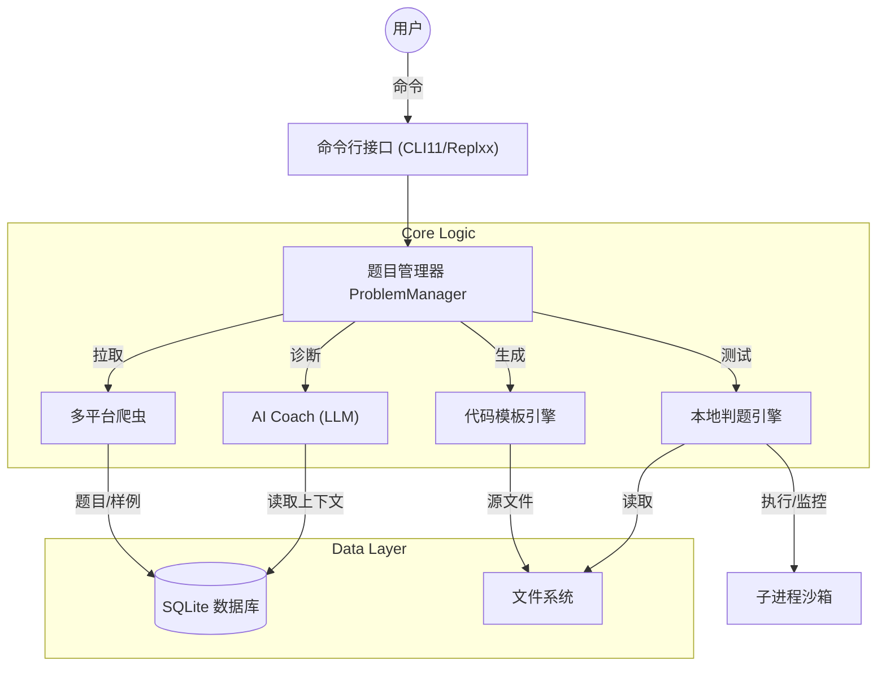

<div align="center">

```text
  ███████╗██╗  ██╗██╗   ██╗ █████╗ ████████╗██╗
  ██╔════╝██║  ██║██║   ██║██╔══██╗╚══██╔══╝██║
  ███████╗███████║██║   ██║███████║   ██║   ██║
  ╚════██║██╔══██║██║   ██║██╔══██║   ██║   ██║
  ███████║██║  ██║╚██████╔╝██║  ██║   ██║   ██║
  ╚══════╝╚═╝  ╚═╝ ╚═════╝ ╚═╝  ╚═╝   ╚═╝   ╚═╝
```

# Shuati CLI

[](https://github.com/Xustalis/shuati-Cli/actions/workflows/ci.yml)
[](https://opensource.org/licenses/MIT)
[](https://en.cppreference.com/w/cpp/20)
[](https://github.com/Xustalis/shuati-Cli/releases)
**Shuati CLI** 是一个基于命令行的算法练习工具：拉题、生成本地代码文件、运行本地测评、记录复习进度，并提供 AI 启发式提示。

本项目适合习惯使用 CLI 和 Vim/VSCode 等本地编辑器，且希望脱离浏览器 Web IDE 低效调试环节的开发者。

[快速开始](#快速开始) • [安装指南](#安装指南) • [配置说明](#配置说明) • [故障排除](#故障排除) • [开发指南](#开发指南)

</div>

---

## 🏗 架构概览

Shuati CLI 采用分层架构设计，核心包括爬虫适配器、本地判题沙箱和 AI 诊断模块。


```mermaid
graph TD
    User((用户)) -->|命令| CLI["命令行接口 (CLI11/Replxx)"]
    CLI --> PM["题目管理器 ProblemManager"]
    
    subgraph Core Logic
        PM -->|拉取| Crawler[多平台爬虫]
        PM -->|生成| Template[代码模板引擎]
        PM -->|测试| Judge[本地判题引擎]
        PM -->|诊断| AI["AI Coach (LLM)"]
    end
    
    subgraph Data Layer
        DB[("SQLite 数据库")]
        FS[文件系统]
    end
    
    Crawler -->|题目/样例| DB
    Template -->|源文件| FS
    Judge -->|读取| FS
    Judge -->|执行/监控| Sandbox[子进程沙箱]
    AI -->|读取上下文| DB
```

## 快速开始

### 系统要求

- **Windows**: Windows 10/11（x64）
- **Linux/macOS**: x64
- **运行时**:
  - C++ 题目本地测评：需要 `g++`（Windows 推荐 MinGW-w64/GCC 10+；Linux/macOS 使用系统 GCC/Clang）
  - Python 题目本地测评：需要 `python`（3.x）

### 方式 A：下载 Release（二进制）

1. 前往 [Releases](https://github.com/Xustalis/shuati-Cli/releases) 下载对应平台的压缩包
2. 解压后将 `shuati`（或 `shuati.exe`）加入 `PATH`
3. 验证：

```bash
shuati --help
```

Windows 也可以在解压目录运行安装脚本（可选）：

```powershell
.\install.ps1
```

### 方式 B：源码构建（开发者）

#### 依赖

- Git
- CMake 3.20+
- 编译器：MSVC（VS2022）/ GCC 10+ / Clang 12+
- vcpkg（本项目使用 `vcpkg.json` 管理依赖）

```bash
git clone https://github.com/Xustalis/shuati-Cli.git
cd shuati-Cli

git clone https://github.com/microsoft/vcpkg.git
.\vcpkg\bootstrap-vcpkg.bat

cmake -B build -S . -DCMAKE_TOOLCHAIN_FILE=.\vcpkg\scripts\buildsystems\vcpkg.cmake
cmake --build build --config Release

.\build\Release\shuati.exe --help
```

## 核心工作流

Shuati CLI 的设计理念是 **"Pull -> Solve -> Test -> Debug"** 闭环。

### 1. 初始化项目
在任意工作目录下初始化结构，生成 `.shuati/`、SQLite 数据库和配置文件。

```bash
shuati init
```

### 2. 拉取题目 (Pull)
支持 LeetCode (CN/US), Luogu, Codeforces 等平台。

```bash
shuati pull https://leetcode.cn/problems/two-sum/
```

### 3. 解题 (Solve)
生成本地代码文件（最小骨架）

```bash
shuati solve 1
```

### 4. 本地测试 (Test)
运行样例，并自动生成边界/正常/组合测试点（可选生成预期输出）。

```bash
shuati test 1
```

常用参数：

```bash
shuati test 1 --max 30 --oracle auto
shuati test 1 --oracle none
shuati test 1 --ui
```

### 5. 获取提示 (Hint)
结合题目、样例与当前代码，输出启发式提示（不直接给完整解法）。

```bash
shuati hint lg_P5728
shuati hint lg_P5728 -f solution_lg_P5728.cpp
```

## 配置说明

配置文件位于项目根目录：`.shuati/config.json`。

```json
{
  "api_key": "",
  "api_base": "https://api.deepseek.com/v1",
  "model": "deepseek-chat",
  "language": "cpp",
  "max_tokens": 300,
  "editor": "code",
  "ai_enabled": true,
  "template_enabled": true
}
```

常用配置命令：

```bash
shuati config --show
shuati config --api-key <YOUR_KEY>
shuati config --model deepseek-chat
shuati config --language cpp
```

## 安装指南

### 安装步骤

1. 前往 [Releases](https://github.com/Xustalis/shuati-Cli/releases) 页面下载对应平台的压缩包。
2. **Windows 用户**：
   - 解压下载的 zip 文件。
   - 右键点击 `install.ps1` 并选择 "使用 PowerShell 运行" (或在终端运行 `.\install.ps1`)，脚本会自动将 `shuati.exe` 添加到 PATH 并初始化。
   - 或者手动将解压目录添加到 PATH 环境变量。

3. **Linux/macOS 用户**：
   - 下载对应二进制文件。
   - 赋予可执行权限并移动到 PATH 路径下：
     ```bash
     chmod +x shuati
     mv shuati /usr/local/bin/  # 或 ~/.local/bin
     ```

4. **验证文件完整性** (推荐)：
   下载对应的 `.sha256` 文件并运行校验：
   ```bash
   # Windows (PowerShell)
   Get-FileHash .\shuati.exe -Algorithm SHA256
   # 对比输出的 Hash 与 .sha256 文件内容是否一致

   # Linux/macOS
   shasum -a 256 -c shuati-Linux.sha256
   ```
4. 将二进制文件所在目录加入系统 `PATH` 环境变量。
5. 验证安装：
   ```bash
   shuati --help
   ```

## 本地判题引擎

本项目内置了一个轻量级 OJ 判题器 (`src/core/judge.cpp`)，实现标准 ACM 判题逻辑。

| Verdict | 含义 | 判定逻辑 |
| :--- | :--- | :--- |
| **AC** | Accepted | Stdout 与 Expected 一致 (忽略行末空格) |
| **WA** | Wrong Answer | Stdout 与 Expected 不一致 |
| **TLE** | Time Limit Exceeded | 运行时间超过限制 (默认 1s)，子进程被 Kill |
| **MLE** | Memory Limit Exceeded | 峰值内存超过限制 (Windows下使用 PSAPI 监控) |
| **RE** | Runtime Error | 进程退出码非 0 |
| **CE** | Compile Error | 编译器 (g++) 返回非 0 |

## 故障排除

### 1) `-std=c++20` 不支持 / 编译器过旧

- 升级 MinGW-w64 / GCC（推荐 GCC 10+）
- 或在项目配置中使用更现代的编译器（MSVC/Clang）

### 2) Windows 运行时报缺少 DLL

- 使用 Release 压缩包自带的 DLL 一起部署
- 或确保 `vcpkg_installed/.../bin` 里的依赖 DLL 与 `shuati.exe` 同目录

### 3) `list` 输出 `invalid utf8`

- 这通常是抓取内容/本地数据库中存在非 UTF-8 文本导致。升级到 v1.3.1+ 后会对 SQLite 读取做兜底转换；
- 若仍遇到，建议使用 Windows Terminal 并将编码设置为 UTF-8。

### 4) `test` 没有测试用例/无法校验

- 部分平台可能抓不到完整样例；可使用 `--oracle ai` 生成预期输出，或 `--oracle none` 仅做运行检查。

## 开发指南

### 本地构建

```bash
git clone https://github.com/Xustalis/shuati-Cli.git
cd shuati-Cli

git clone https://github.com/microsoft/vcpkg.git
.\vcpkg\bootstrap-vcpkg.bat

cmake -B build -S . -DCMAKE_TOOLCHAIN_FILE=.\vcpkg\scripts\buildsystems\vcpkg.cmake
cmake --build build --config Debug
.\build\Debug\shuati.exe --help
```

### 运行内部测试

项目包含一些内部测试的可执行文件，用于验证核心模块的功能：

- `test_version`: 验证版本号解析逻辑
- `test_judge_complex`: 验证判题引擎（需要 gcc 环境）
- `test_memory`: 验证记忆管理模块

运行方式（在 build 目录下）：

```bash
ctest --verbose
# 或者直接运行
.\build\Debug\test_judge_complex.exe
```

## 自动化发布

本项目提供一套自动化发布流水线：**合并到 main -> 自动计算下一个语义化版本 -> 更新版本号/CHANGELOG -> 打 tag -> 构建多平台产物 -> 发布到 GitHub Release**。

### 触发条件

- 合并/推送到 `main`：自动执行“准备发布”（计算版本并创建 tag）
- `vX.Y.Z` tag 推送：自动执行“构建发布”（打包产物并创建/更新 GitHub Release）
- 手动触发：在 Actions 中运行 `Prepare Release` / `Release` / `Rollback Release`

### 版本号自动递增（SemVer）

流水线会根据最近一次 `vX.Y.Z` tag 之后的提交记录（Conventional Commits）决定版本递增：

- `feat:` 或 `feat(scope):` -> minor
- `fix:` / `perf:` -> patch
- `!` 或 `BREAKING CHANGE:` -> major

示例：

- `feat(test): add case generator`
- `fix(list): handle invalid utf8`
- `feat!: change config format`

### 更新说明生成

发布说明会从 Conventional Commits 自动生成，并写入 `CHANGELOG.md` 的新版本段落；Release 页面会读取对应版本段落作为 Release Notes。

本地预览（不改动仓库文件）：

```bash
python tools/release/plan_release.py
```

自定义模板（可选）：在仓库添加 `.github/release-notes-template.md`，支持占位符：

- `{{tag}}` / `{{version}}`
- `{{previous_tag}}` / `{{compare_url}}`
- `{{notes}}` / `{{contributors}}`

### 权限、令牌与通知

- GitHub Release / tag / 推送版本提交使用 `GITHUB_TOKEN`（Actions 内置），需要 `contents: write` 权限（已配置）
- 可选通知：配置仓库 Secret `RELEASE_WEBHOOK_URL`（例如 Slack/飞书/自定义 Webhook），发布完成后会 POST 一条消息

### 回滚机制

如果误发版本，可在 Actions 中运行 `Rollback Release`：

- 删除指定 tag 对应的 GitHub Release
- 删除远端 tag 引用

如需回滚代码版本，请在 `main` 上对发布提交执行 `git revert` 并合并回 `main`。

### 贡献

- Issue/PR 模板在 `.github/`
- 贡献指南见 [CONTRIBUTING.md](CONTRIBUTING.md) 与 [.github/CONTRIBUTING.md](.github/CONTRIBUTING.md)

我们非常欢迎社区贡献。为了保持代码质量，请遵循以下规范：

- Bug 提交：优先用 Issue 模板
- 功能建议：先提 Issue 再开 PR
- 代码提交：确保 CI 通过
