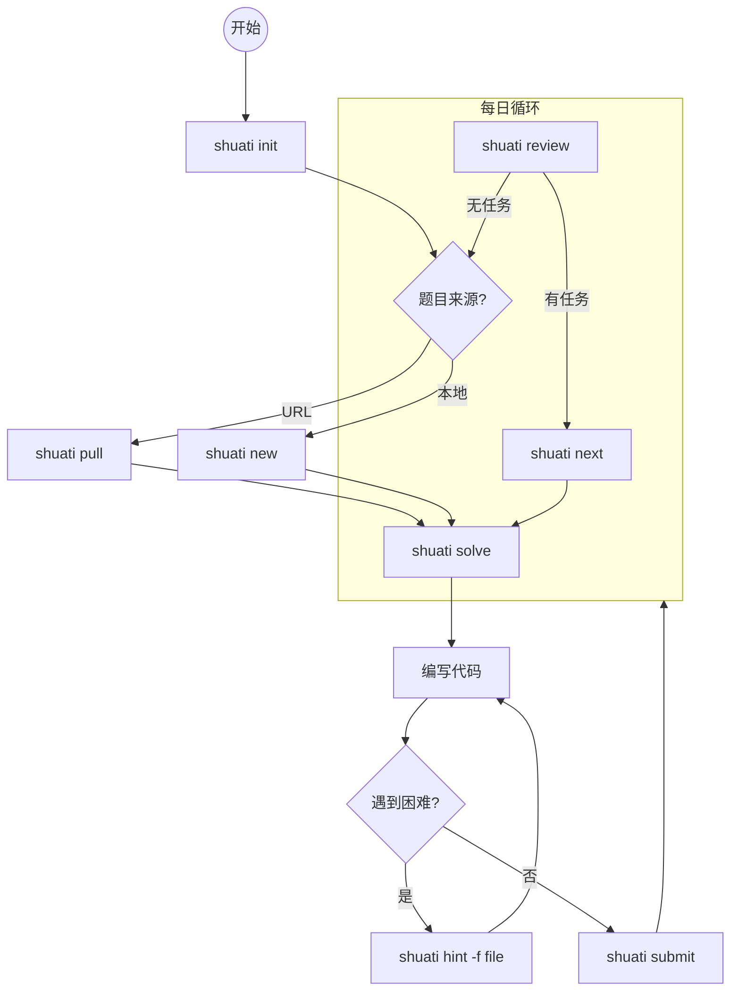

# shuati CLI - 你的 AI 智能算法教练

> **刷题不是为了 AC，而是为了不再犯同样的错。**

**shuati CLI** 是一个以命令行 (CLI) 优先的智能刷题辅助工具。它不直接提供答案，而是像教练一样，追踪你的错误，提供基于 AI 的低成本提示，并利用间隔重复算法（SM-2）安排复习计划。

---

## 🚀 核心工作流


```mermaid
graph TD
    Start((开始)) --> Init[shuati init]
    Init --> Pull{题目来源?}
    Pull -->|URL| PullWeb[shuati pull <url>]
    Pull -->|本地| New[shuati new <title>]
    
    PullWeb --> Solve[shuati solve <id>]
    New --> Solve
    
    Solve --> Code[编写代码]
    Code --> Stuck{遇到困难?}
    Stuck -->|是| Hint[shuati hint <id> -f file]
    Hint --> Code
    
    Stuck -->|否| Submit[shuati submit <id>]
    Submit --> ReviewLoop
    
    subgraph ReviewLoop [每日循环]
        Review[shuati review] -->|有任务| Next[shuati next]
        Next --> Solve
        Review -->|无任务| Pull
    end
```

---

## ✨ 功能特性

| 命令 | 说明 | 场景 |
|:---|:---|:---|
| `shuati init` | 初始化项目 | 首次使用，创建数据库 |
| `shuati pull <url>` | 拉取题目 | 从网页复制题目链接，自动生成 Markdown |
| `shuati new <title>` | 本地出题 | 自己练习或记录面试题 |
| `shuati solve <id>` | **开始做题** | 生成代码模板 `solution_xxx.cpp` |
| `shuati hint <id>` | **AI 提示** | 没思路？AI 给提示 (不给代码)，低 Token |
| `shuati submit <id>` | **提交记录** | 记录自评难度 (0-5) 和错误类型 |
| `shuati review` | 复习检查 | 查看今日待复习题目 (基于 SM-2) |
| `shuati next` | **智能推荐** | 系统告诉你下一步该做什么 |
| `shuati stats` | 错误统计 | 查看你的薄弱项图表 |
| `shuati config` | 系统配置 | 设置 API Key 和模型 |

---

## 🏎️ 快速开始

### 1. 初始化
在你的刷题目录运行：
```bash
shuati init
```

### 2. 配置 AI (可选)
使用 DeepSeek API 获取智能提示：
```bash
shuati config --api-key sk-xxxxxx --model deepseek-chat
```

### 3. 拉取题目
以两数之和为例：
```bash
shuati pull https://leetcode.com/problems/two-sum/
# 输出: [SUCCESS] 题目 'Two Sum' 已保存至 web_17707...md
```

### 4. 开始解题
```bash
shuati solve web_17707
# 输出: [SUCCESS] 代码模板已生成: solution_web_17707.cpp
```
现在，使用你喜欢的编辑器 (VSCode, Vim) 编辑生成的 `.cpp` 文件。

### 5. 提交记录
当你完成后：
```bash
shuati submit web_17707 -q 3
# -q: 自评难度 (0:完全不会, 3:有挑战, 5:秒杀)
# 如果难度 < 3，系统会追问具体的错误类型 (如: 边界错误、贪心误用)
```

### 6. 每日复习
每天开始刷题前，先检查复习任务：
```bash
shuati review
# 输出: === 今日待复习 (2 题) ===
#   [web_17707] Two Sum (间隔: 1天)
```

---

## 🧠 技术原理：间隔重复 (Spaced Repetition)

shuati CLI 内置了 **SM-2 算法**。它可以根据你每次提交的反馈质量 (Quality 0-5)，自动计算下一次复习的最佳时间点。

*   **Quality 5 (秒杀)** -> 间隔大幅增加
*   **Quality 3 (掌握)** -> 间隔适度增加
*   **Quality 0 (遗忘)** -> 间隔重置为 1 天

---

## 🛠️ 构建指南

### 环境要求
*   Windows / Linux / macOS
*   C++20 编译器
*   CMake 3.20+
*   Git

### 编译步骤
```bash
# 1. 克隆代码
git clone https://github.com/your-repo/shuati-cli.git
cd shuati-cli

# 2. 安装依赖 (vcpkg)
git clone https://github.com/microsoft/vcpkg.git
./vcpkg/bootstrap-vcpkg.bat
./vcpkg/vcpkg.exe install

# 3. 编译 (Release)
cmake -B build -S . -G "Visual Studio 17 2022" -DCMAKE_TOOLCHAIN_FILE=vcpkg/scripts/buildsystems/vcpkg.cmake
cmake --build build --config Release

# 4. 运行
./build/Release/shuati.exe --help
```

---

## 📊 错误分析

shuati 不仅仅记录题目，更记录**错误**。使用 `shuati stats` 查看你的薄弱环节：

```text
=== 错误类型统计 (共 15 次) ===

  Off-by-one (边界错误)    5  #####
  状态定义错误             3  ###
  贪心策略误用             2  ##
  ...
```

---

## License

MIT © 2026 Shuati CLI Team
