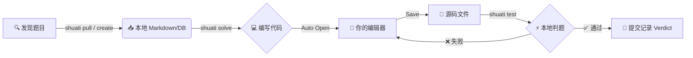

<div align="center">

```text
  ███████╗██╗  ██╗██╗   ██╗ █████╗ ████████╗██╗
  ██╔════╝██║  ██║██║   ██║██╔══██╗╚══██╔══╝██║
  ███████╗███████║██║   ██║███████║   ██║   ██║
  ╚════██║██╔══██║██║   ██║██╔══██║   ██║   ██║
  ███████║██║  ██║╚██████╔╝██║  ██║   ██║   ██║
  ╚══════╝╚═╝  ╚═╝ ╚═════╝ ╚═╝  ╚═╝   ╚═╝   ╚═╝
```

**Shuati CLI 专为 OIer 和 Coder 打造的本地化、智能化命令行刷题工具🚀**

[](https://github.com/Xustalis/shuati-Cli/releases)
[](https://github.com/Xustalis/shuati-Cli/actions)
[](LICENSE)
[](https://en.cppreference.com/w/cpp/20)

[🚀 快速开始](#-15分钟快速上手) • [📥 安装指南](#-安装指南) • [✨ 核心特性](#-核心特性) • [📚 文档](#-详细文档) • [❓ FAQ](#-常见问题)

</div>

## 📖 项目简介

Shuati CLI 是一款专为算法爱好者设计的命令行工具。它不仅能帮助你从各大 OJ 平台自动拉取题目，接管你的 "编码 -> 测试 -> 提交" 工作流，更引入了 AI 辅助，高效管理算法练习题、追踪学习进度、自动分析错题，让刷题更加智能化。

## 🚀 15分钟快速上手

按照以下步骤，在 15 分钟内完成环境搭建并解决你的第一道算法题。

### 1️⃣ 一键安装

**Windows 快速安装:**
打开你的 PowerShell（可以按 Win 键搜索 "PowerShell"），复制并运行下面这两行命令：
```powershell
irm https://github.com/Xustalis/shuati-Cli/releases/latest/download/shuati-cli-setup.exe -OutFile shuati-cli-setup.exe
.\shuati-cli-setup.exe
```

### 2️⃣ 初始化练习目录 (2分钟)

安装完成后，你可以随便找个地方新建一个文件夹，作为你的专属刷题库：

```bash
# 创建并进入一个新的练习目录
mkdir my-algorithm-practice
cd my-algorithm-practice

# 初始化 Shuati 项目
shuati init
```

### 3️⃣ 开始你的第一题 (5分钟)

我们以 LeetCode 经典的第一题 "两数之和" 为例：

```bash
# 从 LeetCode 拉取这道题
#（这会自动将题目描述和测试用例下载到本地,同样也支持洛谷、Codeforces、蓝桥云课）
shuati pull https://leetcode.cn/problems/two-sum/

# 2. 开始解题 (自动生成文件并打开编辑器)
shuati solve 1
# 或者使用题目 ID: shuati solve lc_1
```
*此时，你的代码编辑器已经打开了包含标准头文件的模板。请编写逻辑并保存。*

### 4️⃣ 一键本地评测

代码写完后，不需要去网页端提交盲猜，直接在当前目录测试：

```bash
# 直接在本地运行全部测试用例
shuati test 1

# 如果全部标绿表示通过！
# 如果有错误的用例，开启 AI 后会自动诊断代码
```

## ✨ 核心功能与亮点

<div align="center">

| 🎯 题目管理 | ⚡ 本地离线评测 | 🤖 AI 智能教练 |
| :--- | :--- | :--- |
| • 一键抓取题面与测试用例<br>• CF/LC/洛谷/蓝桥云课<br>• 本地 Markdown 题库归档<br>• 支持手动创建本地题目 | • 无需联网即可测试自带用例<br>• C++ / Python 实时编译运行<br>• 保护系统的防爆沙箱机制 | • DeepSeek 深度集成<br>• 超越题解的交互式代码诊断<br>• 获取递进式的解题思路提示 |

| 📊 进度追踪 (复习) | 💻 无缝快捷流 | ✔️ 精确安全 |
| :--- | :--- | :--- |
| • 自动记录每次 Verdict<br>• 实时统计通过率与成长线<br>• 错题分类统计<br>• 基于 SM2 的自动打分复盘机制 | • 沉浸式 REPL 交互模式<br>• 智能识别编辑器 (VSCode/Vim)<br>• 新解题文件自动智能命名规约 | • 跨平台硬沙箱防注入与内存超限拦截<br>• 全节点无损 UTF-8 文件名防乱码<br>• 高度解耦与可配置化 |

</div>

## 🛠️ 基本工作流演示


```mermaid
graph LR
    A[🔍 发现题目] -->|shuati pull / create| B("📥 本地 Markdown/DB")
    B -->|shuati solve| C{💻 编写代码}
    C -->|Auto Open| D[📝 你的编辑器]
    D -->|Save| E[💾 源码文件]
    E -->|shuati test| F{⚡ 本地判题}
    F -->|❌ 失败| D
    F -->|✅ 通过| G[🚀 提交记录 Verdict]
```

## 📥 安装指南

### 安装包
**Windows** 下载最新的 Windows 安装包并执行（请进入发布页面获取对应版本的 `.exe`）：
```powershell
irm https://github.com/Xustalis/shuati-Cli/releases/latest/download/shuati-setup-x64-Windows.exe -OutFile shuati-setup-x64-Windows.exe
.\shuati-setup-x64-Windows.exe
```

### 从源码编译 (Linux / macOS / Windows)

**前置依赖**
- CMake (>= 3.20)
- vcpkg (C++ 包管理器)
- Git
- 支持 C++20 的编译器 (GCC 10+ / Clang 10+ / MSVC)

**编译步骤**

```bash
# 1. 克隆仓库
git clone https://github.com/Xustalis/shuati-Cli.git
cd shuati-Cli

# 2. 配置项目（请替换 [vcpkg路径] 为你的实际路径）
cmake -B build -S . -DCMAKE_TOOLCHAIN_FILE=[vcpkg路径]/scripts/buildsystems/vcpkg.cmake

# 3. 构建
cmake --build build --config Release

# 4. 运行测试确保无误
ctest --test-dir build -C Release

# 5. 安装（可选）
cmake --install build
```

## ❓ 常见问题 (FAQ)

<details>
<summary><strong>Q1: 运行 <code>shuati test</code> 时提示 "Compiler not found" 或编译失败怎么办？</strong></summary>

**A:** Shuati 并没有内置编译器，它在底层会直接调用你电脑上的编译器。
- **C++ 语言**: 请确保你已经安装了 `MinGW-w64` (Windows)，并将它所在的文件夹中的 `bin` 路径添加到了系统的环境变量 Path 中，而且编译器需要支持 **C++20** 标准。
- **Python 语言**: 请确保你已经安装了 Python (3.8+版本)，并且 `python` 能在命令行中直接使用。
</details>

<details>
<summary><strong>Q2: 怎么改变默认的编程语言？</strong></summary>

**A:** Shuati 默认会为你生成 C++ 的模板。如果你要写 Python，只需要运行一次：
```bash
shuati config --language python
```
(如果以后想换回 C++，运行 `shuati config --language cpp` 即可。)
</details>

<details>
<summary><strong>Q3: 如何配置并使用 AI 解题提示功能？</strong></summary>

**A:** 我们深度集成了大语言模型，你需要准备一个 DeepSeek (或其他兼容接口) 的 API Key。配置方法如下：

```bash
# 替换为你的真实密钥
shuati config --api-key "sk-xxxxxxxx"

# 如果你想指定非默认使用的模型名称，也可以这样：
shuati config --model "deepseek-chat"
```
配置完成后，当你在敲题没思路时，运行 `shuati hint <题目ID>`，或者在 `shuati test <题目ID>` 没通过时，AI 会自动开始为你分析问题。
</details>

<details>
<summary><strong>Q4: 对于蓝桥云课等需要账号登录才能看到的题目，我该如何拉取？</strong></summary>

**A:** 我们提供了简单的登录凭据加载命令。目前已经支持了蓝桥网：
```bash
shuati login lanqiao
```
根据提示操作并粘贴你在浏览器上获取到的 Cookie 即可无缝拉取题库。
</details>

<details>
<summary><strong>Q5: 本地测试失败了，但我感觉我写的没错？</strong></summary>

**A:** `shuati test` 会运行题目附带的样例测试。如果报错，通常是格式对齐问题或未处理好的特殊边界（数组越界等）。如果百思不得其解，确保打开了 AI 开关，测试失败后工具会自动诊断你的错误所在并为你出主意。
</details>

## 📚 常用命令速查

| 命令分类 | 具体命令                 | 作用介绍                                          | 命令示例                                     |
| :------- | :----------------------- | :------------------------------------------------ | :------------------------------------------- |
| **基础** | `shuati init`            | 在当前目录下创建数据库，初始化整个工作区环境      | `shuati init`                                |
| **基础** | `shuati repl`            | 进入交互式沉浸命令行模式，支持长驻工作及命令补全      | `shuati repl`                                |
| **基础** | `shuati list` / `ls`     | 列出当前本地题库所有题目的简略列表                | `shuati list`                                |
| **开题** | `shuati pull <url>`      | 根据网址将 OJ 平台上的题目拉取到本地                | `shuati pull https://leetcode.cn/...`        |
| **开题** | `shuati new <title>`     | 手动创建一道暂不在主流平台的自定义算法题            | `shuati new "01背包变形" --tags "dp"`        |
| **做题** | `shuati solve <id>`      | 自动生成代码骨架并打开本地编辑器                    | `shuati solve 12` 或 `shuati solve lc_1`     |
| **做题** | `shuati hint <id>`       | 做不出来时，唤起 AI 获取关键解题线索和思路线段提示  | `shuati hint 1`                              |
| **做题** | `shuati test <id>`       | 跑本地自动运行测试并判题，如果失败将由 AI 辅助分析  | `shuati test 1`                              |
| **做题** | `shuati view <id>`       | 深度查看某个测试点的输出情况和期望数据的 Diff 差异  | `shuati view 1`                              |
| **收尾** | `shuati submit <id>`     | 做完题目后用于手动记录自我掌握度到错题本地数据库    | `shuati submit 1`                            |
| **设置** | `shuati config`          | 查看或配置整个工具链的运行上下文 (API、环境等)        | `shuati config --api-key xxx`                |
| **维护** | `shuati delete <id>`     | 从此刷题练习库中彻底剔除这道题目记录和原文件          | `shuati delete 1`                            |
| **维护** | `shuati clean`           | 一键清理由于编译过程或者动态对拍产生的垃圾临时文件    | `shuati clean`                               |

## 📥 从源码手动编译 (Linux / macOS / Windows)

如果你不是通过提供的一键安装包，而是偏好源码构建：

**前置系统依赖需要有：**
- **CMake** (>= 3.20)
- **vcpkg** (C++ 跨平台包管理器)
- **支持 C++20 的主流编译器** (GCC 10+ / Clang 10+ / MSVC 2022)

**编译步骤：**

```bash
# 1. 把仓库克隆下来
git clone https://github.com/Xustalis/shuati-Cli.git
cd shuati-Cli

# 2. 告诉 CMake 你的 vcpkg 在什么地方（请将下面路径替换为真实路径）
cmake -B build -S . -DCMAKE_TOOLCHAIN_FILE=[你机器上的vcpkg路径]/scripts/buildsystems/vcpkg.cmake

# 3. 开始执行构建和编译
cmake --build build --config Release

# 4. 可选测试和安装到系统目录
ctest --test-dir build -C Release
cmake --install build
```

## 🤝 贡献指南

欢迎提交 Issue / PR！一些很适合贡献的方向：

- 新平台抓题支持（AtCoder 等）
- 评测器与执行器增强（性能、日志、隔离）
- 复习算法与分析指标改进
- 文档与示例补全

### 开发构建
```bash
cmake -B build
cmake --build build
```

### 代码规范
- 项目使用 **C++20** 标准。
- 提交代码前，请确保您的代码风格符合项目规范，并确保所有测试用例通过。
- 提交信息请遵循 [Conventional Commits](https://www.conventionalcommits.org/) 规范（例如：`feat(test): add boundary case generation`）。

详细开发指南请参阅 [`CONTRIBUTING.md`](CONTRIBUTING.md)。

## 📄 许可证 & 致谢

本项目采用 [MIT License](LICENSE) 开源许可证。

特别感谢以下优秀的开源项目：
- [FTXUI](https://github.com/ArthurSonzogni/FTXUI) - 强大的终端 UI 框架
- [CLI11](https://github.com/CLIUtils/CLI11) - 优雅的命令行解析库
- [nlohmann/json](https://github.com/nlohmann/json) - 现代 C++ JSON 库
- [SQLiteCpp](https://github.com/SRombauts/SQLiteCpp) - 易用的 SQLite C++ 封装

## 💬 联系我们

- **GitHub Issues**: 提交 [Bug](https://github.com/Xustalis/shuati-Cli/issues) 或特性需求
- **Email**: gmxenith@gmail.com
<br>

<div align="center">
  <b>🌟 Happy Coding! 🚀</b>
</div>
